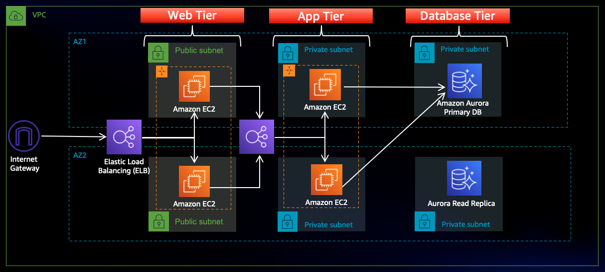

This project showcases a **production-ready 3-tier architecture** built entirely using **AWS native services** to host a scalable, highly available WordPress application. No Infrastructure as Code tools were used — all resources were manually provisioned via the AWS Console to demonstrate deep understanding of service integration.

---

## 📌 Architecture Overview

### 🧱 Tiers Breakdown

- **Web Tier** (Public Subnets):
  - EC2 instances (Apache + PHP + WordPress)
  - Public ALB for distributing traffic
  - Auto Scaling Group (ASG) for high availability

- **App Tier** (Private Subnets):
  - EC2 instances (logic/middleware)
  - Internal load balancing (optional)
  - Secured via Security Groups

- **Database Tier** (Private Subnets):
  - Amazon RDS (MySQL) with Multi-AZ
  - Restricted to App Tier access only

---

## 🚀 AWS Services Used

| Service       | Purpose                                       |
|---------------|-----------------------------------------------|
| EC2           | Hosts WordPress (Web/App Tier)                |
| ALB           | Load balances traffic across Web Tier         |
| ASG           | Auto scaling for fault tolerance              |
| RDS           | Managed MySQL DB with Multi-AZ setup          |
| S3            | Asset storage / backups (optional)            |
| CloudFront    | CDN for global performance and caching        |
| Route 53      | DNS routing to ALB or CloudFront              |
| VPC           | Network isolation for 3-tier setup            |
| CloudWatch    | Monitoring and alerting                       |
| CloudTrail    | Tracks API activity for auditing              |
| IAM           | Access control and EC2 roles                  |
| SNS           | For Secure Access                             |

---

## 🔐 Security Implementation

- Public subnet access limited to ALB only
- EC2 and RDS secured with least-privilege **Security Groups**
- IAM roles used for EC2 instances (e.g., CloudWatch, S3)
- NAT Gateway used to allow private subnets outbound access only
- No RDS exposure to internet — only App Tier can connect

## 🧠 Lessons Learned

- Designed fault-tolerant and auto-healing infrastructure from scratch
- Understood subnetting and VPC route table associations in depth
- Got hands-on with ALB health checks and scaling policies
- Secured infrastructure using IAM roles and Security Groups
- Configured and tested Multi-AZ RDS with backup and monitoring

---

## 📄 Project Summary

| Area                  | Details                                               |
|-----------------------|--------------------------------------------------------|
| **Deployment Method** | AWS Console (no Terraform used)                       |
| **App Deployed**      | WordPress (manual install on EC2)                     |
| **Network Topology**  | 2 AZs, 6 subnets (Web, App, DB tiers)                 |
| **Monitoring**        | CloudWatch + CloudTrail + ASG lifecycle events        |
| **Scaling**           | ASG for Web Tier + RDS Multi-AZ setup                 |
| **CDN + DNS**         | CloudFront and Route 53 used for speed and reach      |

---

## 👨‍💻 Author

**Nawaz Kapadia** – Cloud Solutions Architect | DevOps Enthusiast

## 📜 License

This project is licensed under the [MIT License](LICENSE).
